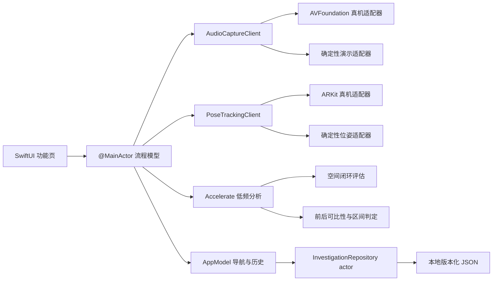

# 架构与测量不变量

## 设计目标

应用从用户问题出发，不从仪器面板出发。硬件输入、分析、业务判定和界面状态分层，以便用合成信号和演示服务重复验证同一条用户流程。

## 模块责任

| 模块 | 责任 | 不负责 |
| --- | --- | --- |
| `Features` | 解释权限、引导录制、三种结果、恢复操作 | 频谱计算和硬件 API |
| `Services/Audio` | 权限、实际采样率、路由、通道和录音生命周期 | 判定是否存在持续音调 |
| `Services/Position` | AR 相对位姿、跟踪质量、跟踪 epoch 和手动降级 | 推测未测位置 |
| `Analysis` | 窗函数、功率谱、持续性、谐波、空间和前后判定 | 绝对声压级、声源识别 |
| `Domain` | Codable/Sendable 值模型和明确的质量原因 | 文件 I/O |
| `Persistence` | schema v1、actor 串行存储和原子替换 | 原始录音持久化 |

## 音频数据流

1. 界面先解释用途，再请求麦克风权限。
2. `AVAudioSession` 使用 `.record` 和 `.measurement`，将 48 kHz 和 20 ms 设为偏好值。分析使用硬件返回的实际格式，不假设偏好值生效。
3. 输入 tap 只复制样本并记录 `AVAudioTime.sampleTime`。停止录制后先确认样本时间连续、有效样本数达到请求时长的 90%，并重读末尾路由与格式；任一条件不符即作废。随后由 `LowFrequencyAnalyzer` 使用 Hann 窗和 Accelerate DFT 分析 10–500 Hz。
4. 单边频谱使用 `2 / (N × Σw²)` 作为均方功率标度。跨时间、位置和前后的聚合先在线性功率域完成，再转换为 dB 相对差。10–500 Hz 整体值在两端各包含 Hann 主瓣宽度的保护 bin，避免带内音调靠近边界时因窗泄漏跨界而产生虚假变化；频谱显示仍只列出 10–500 Hz。
5. 峰检测与锁定频带分开建模。`ToneAnalysis` 回答“是否仍有可重复的峰”，`LockedBandAnalysis` 始终衡量指定中心频率、固定带宽和不重叠时间块。目标峰降到噪声底后，前后数值仍可比较。
6. 结果是“检出持续音调”、“未检出”或“测量无效”。中断、路由改变或样本不足不会生成声学结论。

P0 对多通道输入选择通道 0，并在测量元数据中保存开始时间、路由 ID、用户可读数据源名称、通道数和所选通道。不对多通道波形求平均，避免反相信号抵消。外接多通道的逐通道分析和功率合并需要真实硬件验证，未列入 P0。

## 测量无效条件

以下事件使当前录制无效：

- 音频中断、输入路由改变、引擎配置变化或媒体服务重置；
- 应用进入后台、样本时间不连续、有效样本少于请求量的 90%、信号过弱或削波；
- 空间测量时手机移动、位置不可用、AR 跟踪受限或目标频带时间块波动过大。

测量模型保留具体原因。界面显示恢复操作，不将无效输入降级为低置信结论。

## 空间测量闭环

`ARPoseTrackingClient` 使用 `ARPositionalTrackingConfiguration` 和重力对齐世界坐标。平移保留世界坐标的重力竖直轴，方向使用相对四元数。每次启动或跟踪中断都会更换 epoch；不同 epoch 的点不参与排名。

空间流程先测一个起点，再测至少 2 个候选点。每个候选点后都必须立即返回起点，形成 `起点 A → 候选 B → 起点 A` 的相邻夹测。每个候选的差值使用两侧起点功率的线性平均作为基线。只有以下条件同时成立才能排名：

- 目标频率、音频路由、通道、实际采样率、窗和分析版本一致；
- 所有点质量合格，锁定频带时间块标准差不超过 3 dB；
- 每次录制约每 0.1 秒检查位姿；任一时刻位移超过 `min(3 cm, 波长 / 32)`、方向超过 8°、跟踪受限或 epoch 改变，整点作废；
- 各候选点相对起点的高度差不超过 `min(3 cm, 波长 / 32)`、方向差不超过 10°；
- 每次 AR 起点复测距原点不超过 `min(3 cm, 波长 / 32)`，相邻起点目标频带差不超过 2 dB；
- 候选点相对起点的目标频带降低至少 3 dB。

中间候选点即使没有形成局部峰也会保留锁定频带读数，避免丢失读数。但若最低点没有再次检测到目标峰，A-B-A 仍无法排除声源只在候选测量时停止，因此整轮不生成位置建议。所有空间建议最高为中等可信度，并明确说明仍不能完全排除候选时段的声源变化。建议只能指向已测点。手动位置模式只比较名称，不显示距离或坐标图。目标频带降低但 10–500 Hz 整体升高 3 dB 或以上时，结果页会显示整体低频升高警告。

## 前后比较

比较器以调整前的中心频率和固定半带宽锁定两次测量，使用不重叠时间块，不把重叠窗当作独立样本。锁定带在 10 Hz 和 500 Hz 边界使用变换保护 bin 保持对称；可靠峰必须落在扣除窗分辨率后的频带内区。比较器使用固定种子的 10,000 次重采样估计 90% 区间。第二次目标峰消失时仍比较同一频带，但标明不能单独归因于调整。稳定峰移到其他频率时停止比较。改善需要目标频带差不高于 -3 dB，且区间上界不高于 -1 dB。位置差必须小于 `min(3 cm, 波长 / 32)`。路由、数据源、通道、采样率、分析配置或方向不符合时，结果为“无法判断”。

有限的位置门槛不能限制声学低谷附近的相对误差：厘米级复位也可能造成明显读数变化。AR 位置只用于拒绝明显不一致，不能证明两次处于完全相同的声场点。因此所有前后比较最高为中等可信度，并在结果中保留这一限制；结果只描述两次读数变化，不证明调整造成变化。

## 状态、并发和存储

- 界面模型、AVFoundation 和 ARKit 适配器在 `@MainActor` 上改变状态。
- 分析输入和输出是 `Sendable` 值。原始缓冲只在录制期间存在。
- 存储适配器是 actor。`AppModel` 将快照按创建顺序写入，避免旧快照覆盖新快照。
- 有效的单次声音检查在结果出现时自动保存。归档还保存空间扫描和前后比较，不保存原始样本。P0 没有账号、云同步、遥测或后台录音。

## 已知边界

- 模拟器只验证流程和确定性输入，不验证麦克风频响、音频路由或 AR 漂移。
- 顺序空间扫描仍受时间变化影响；逐候选 A-B-A 只能降低、不能消除声源恰好在 B 时段变化的风险。P0 不给高可信空间归因；目标峰在最低点消失时不生成位置建议。
- 前后复测仍受声学低谷附近的位置敏感性影响。即使通过 AR 位移门槛，也不提供高可信因果结论；固定支架和独立参考麦克风留待后续验证。
- 录音 tap 已按预期时长预留样本容量，但当前仍有逐样本复制和锁。扩展为连续实时显示前，需在真机上检查回调时间和丢帧。
- P0 不包含振动测量。iPhone 公开 Core Motion 单样本速率上限约为 100 Hz，53.2 Hz 会位于 Nyquist 边界外或附近。未来原始加速度分析的上限应为 `min(40 Hz, 0.4 × 实测采样率)`。

## 官方 API 依据

- [AVAudioSession measurement mode](https://developer.apple.com/documentation/avfaudio/avaudiosession/mode-swift.struct/measurement)
- [AVAudioNode installTap](https://developer.apple.com/documentation/avfaudio/avaudionode/installtap%28onbus%3Abuffersize%3Aformat%3Ablock%3A%29)
- [响应音频路由变化](https://developer.apple.com/documentation/avfaudio/responding-to-audio-route-changes)
- [ARPositionalTrackingConfiguration](https://developer.apple.com/documentation/arkit/arpositionaltrackingconfiguration)
- [AR 跟踪质量与会话生命周期](https://developer.apple.com/documentation/arkit/managing-session-life-cycle-and-tracking-quality)
- [Accelerate](https://developer.apple.com/documentation/accelerate)
- [Core Motion 采样率说明，WWDC23 14:16](https://developer.apple.com/videos/play/wwdc2023/10179/?time=856)
